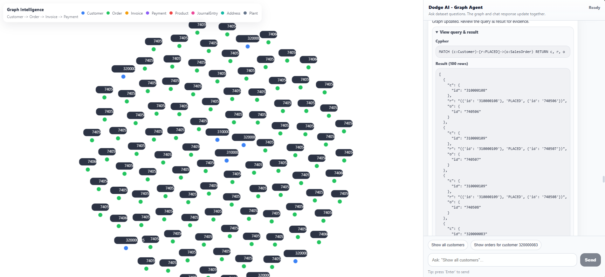
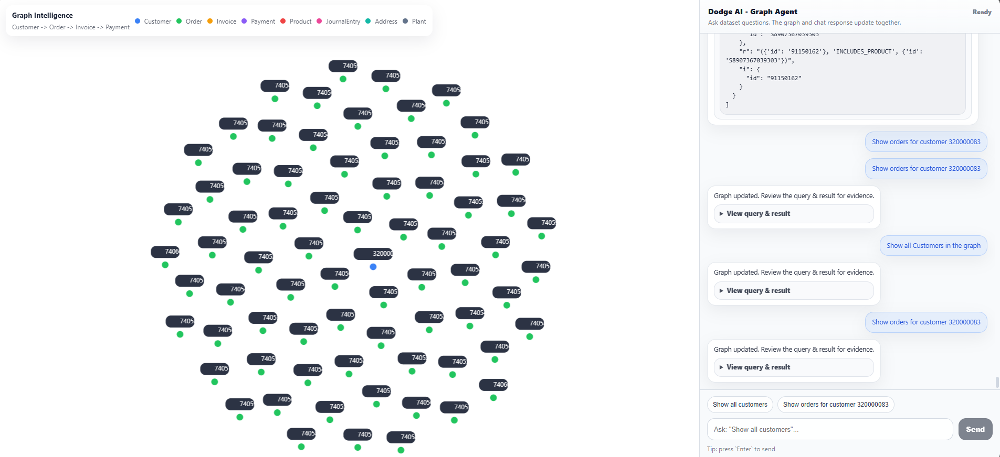
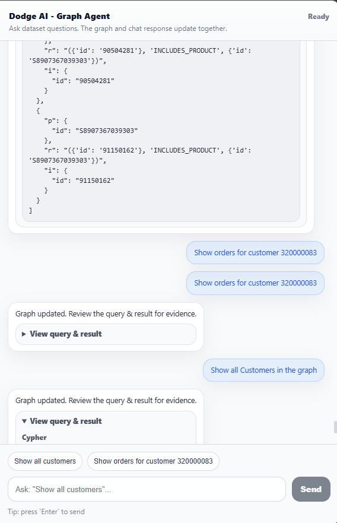

# **LLM Graph Line Chat**

---

##  **Project Overview**

**LLM Graph Line Chat** is a full-stack application that combines:

- ⚛️ React (Frontend)
- ⚡ FastAPI (Backend)
- 🧠 Neo4j (Graph Database)

It allows users to interact with structured business data using a **chat interface powered by graph relationships**.

---

## 🎯 **Project Goal**

The main goals of this project are:

- 🔹 Convert structured SAP-like data into a **graph model**
- 🔹 Enable **relationship-based querying**
- 🔹 Build an **LLM-ready chat interface**
- 🔹 Visualize graph data interactively

---

## 🧱 **What I Built (End-to-End)**

This project was built from scratch and includes:

### 🔹 Backend (FastAPI)
- REST APIs for data handling
- Graph query execution
- Neo4j database connection
- Environment-based configuration

### 🔹 Frontend (React)
- Chat interface UI
- Graph visualization
- API integration
- Clean and responsive design

### 🔹 Database (Neo4j)
- Nodes: Customer, Product, Invoice, Delivery, etc.
- Relationships:
  - `HAS_ADDRESS`
  - `PLACED`
  - `PAID_BY`
  - `INCLUDES_PRODUCT`

---

## 🗂️ **Project Structure**

📂 Folder Structure

LLM-GRAPH-LINE-CHAT/
│
├── backend/
│   ├── main.py
│   ├── database.py
│   ├── graph_builder.py
│   ├── llm_handler.py
│   └── requirements.txt
│
├── frontend-react/
│   ├── src/
│   ├── public/
│   └── package.json
│
├── data/
│   └── sap-o2c-data/
│
├── README.md
└── requirements.txt

---

## ⚙️ Local Setup (Step-by-Step)

🔹 1. Clone Repository

git clone <https://github.com/Monu9500/LLM-GRAPH-LINE-CHAT>
cd LLM-GRAPH-LINE-CHAT

---

🔹 2. Backend Setup

cd backend
pip install -r requirements.txt

Create ".env" file:

NEO4J_URI=neo4j+s://my-instance.databases.neo4j.io
NEO4J_USERNAME=neo4j
NEO4J_PASSWORD=my_password
OPENAI_API_KEY=my_key

Run backend:

python -m uvicorn main:app --reload

---

🔹 3. Frontend Setup

cd frontend-react
npm install
npm start

---

## 🌐 Deployment (Full Process)

🔥 Backend Deployment (Render)

Build Command:

pip install -r requirements.txt

Start Command:

uvicorn main:app --host 0.0.0.0 --port 10000

Environment Variables:

NEO4J_URI=neo4j+s://my-instance.databases.neo4j.io
NEO4J_USERNAME=neo4j
NEO4J_PASSWORD=my_password
OPENAI_API_KEY=my_key

Backend URL:

https://llm-graph-line-chat.onrender.com

---

🔥 Frontend Deployment (Vercel)

Root Directory:

frontend-react

Build Command:

npm run build

Output Directory:

build

Environment Variable:

REACT_APP_API_URL=https://llm-graph-line-chat.onrender.com

Frontend URL:

<https://llm-graph-line-chat.vercel.app/>

---

## 🔄 System Architecture

User (Browser)
   ↓
React Frontend (Vercel)
   ↓ API Call
FastAPI Backend (Render)
   ↓
Neo4j Database
   ↓
Response → Frontend

---

## 🧠 Core Features

- ✅ Graph-based data modeling
- ✅ Neo4j integration
- ✅ Interactive UI (React)
- ✅ API-driven backend
- ✅ Cloud deployment
- ✅ Environment configuration

---

## ⚠️ Problems Faced & Solutions

### Learning phase 

❌ requirements.txt not found

✔ Fixed by correct file placement

❌ NEO4J_URI error

✔ Fixed env variable naming issue

❌ Deployment failure

✔ Fixed build & root directory

❌ API not working

✔ Added REACT_APP_API_URL

---

## 📸 Screenshots

Add My screenshots here (UI, Graph, Chat, Deployment)

Example:

)

---

## 🔗 Important Links

- GitHub Repo: <https://github.com/Monu9500/LLM-GRAPH-LINE-CHAT>
- Backend: <https://llm-graph-line-chat.onrender.com>
- Frontend: <https://llm-graph-line-chat.vercel.app/>

---

# 📦 **Submission Details**

## 🔗 Working Demo Links

- 🌐 **Frontend (Vercel):** <https://llm-graph-line-chat.vercel.app/>
- ⚙️ **Backend (Render):** <https://llm-graph-line-chat.onrender.com>  

---

## 💻 **GitHub Repository**

- 🔗 Repo: <https://github.com/Monu9500/LLM-GRAPH-LINE-CHAT>

---

## 🏗️ **Architecture Overview**

This project follows a **full-stack architecture**:

- **Frontend (React)**  
  - Handles UI, chat interface, and graph visualization  
  - Sends user queries to backend APIs  

- **Backend (FastAPI)**  
  - Processes user input  
  - Connects to Neo4j database  
  - Executes graph queries  
  - Returns structured + graph data  

- **Database (Neo4j)**  
  - Stores data as nodes and relationships  
  - Enables efficient graph traversal and querying  

---

## 🧠 **Database Choice (Why Neo4j?)**

Neo4j was chosen because:

- Graph databases are ideal for **relationship-heavy data**
- Enables **fast traversal queries**
- Better suited than SQL for:
  - Customer → Order → Invoice → Payment flows
- Supports **Cypher query language**, which is intuitive for graph operations

---

## 🤖 **LLM Prompting Strategy**

The AI Agent works using the following approach:

1. Accepts user query in **natural language**
2. Converts query into **structured Cypher query**
3. Executes query in Neo4j
4. Returns:
   - Graph data
   - Structured response

## 👨‍💻 Author

Pritam Ghosh

*YES I AM THE BEST*

---

## My GPT PROMPT: <https://chatgpt.com/g/g-p-69c35f2987b08191b7972b1c1347dc4e-graph-based-data-modeling-and/project>

## 🎉 Conclusion

This project demonstrates a complete full-stack workflow:

Data → Graph → API → UI → Deployment

👉 Built from scratch → Debugged → Successfully deployed 🚀
